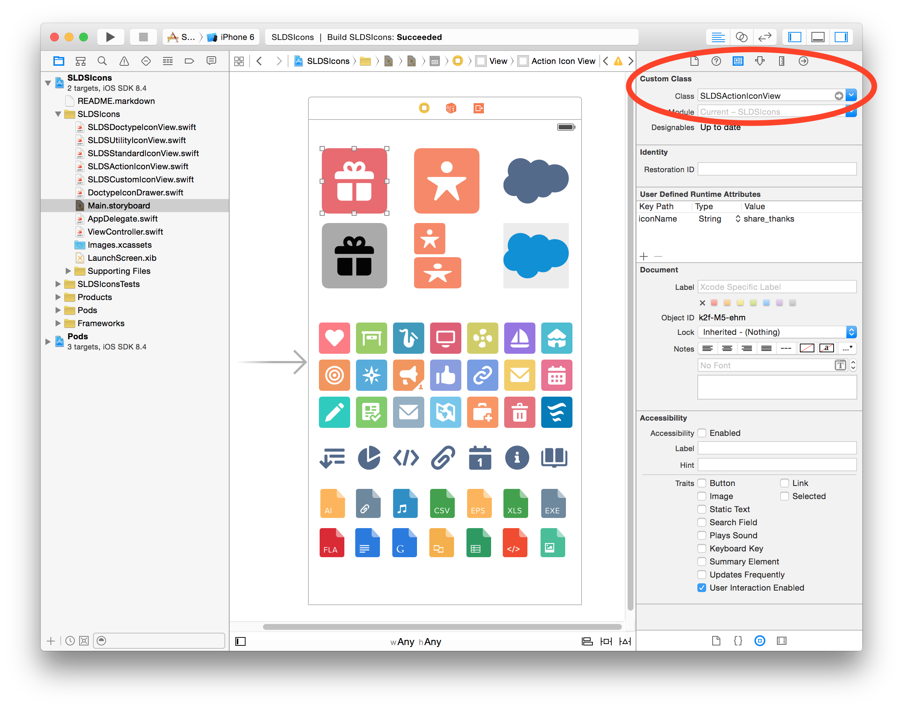
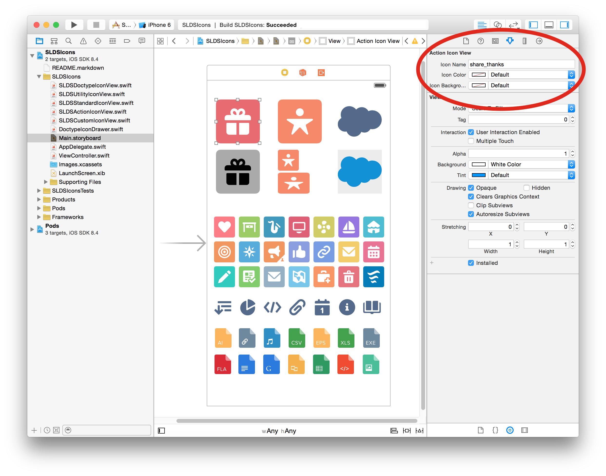
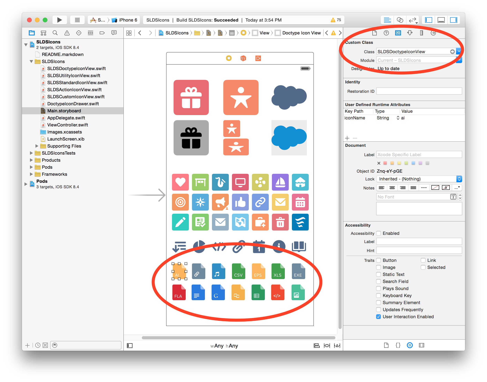

# Salesforce Lightning Design System Icons for iOS

_Create the world's best enterprise app experiences with the [Salesforce Lightning Design System](http://www.lightningdesignsystem.com) (SLDS)_

The code in this repository builds upon the [Salesforce Lightning Design System for iOS](https://www.lightningdesignsystem.com/native/ios) and adds:

1. Design-time support, i.e. use Lightning icons with Xcode storyboards
1. [Doctype icons](https://www.lightningdesignsystem.com/resources/icons#doctype), which aren't currently part of the [Lightning Design System for iOS](https://www.lightningdesignsystem.com/native/ios) 

## Prerequisites

* [Salesforce Lightning Design System for iOS](https://www.lightningdesignsystem.com/native/ios)
* Xcode, version 6.4
* Swift 1.2

## Using Lightning Icons in Your Xcode Project

Check out `Main.storyboard` for examples

1. Add a UIView component to your storyboard

1. Select the custom class according to the Lightning icon category
  - SLDSActionIconView for [action](https://www.lightningdesignsystem.com/resources/icons/#action) icons
  - SLDSCustomIconView for [custom](https://www.lightningdesignsystem.com/resources/icons/#custom) icons
  - SLDSDoctypeIconView for [doctype](https://www.lightningdesignsystem.com/resources/icons/#doctype) icons
  - SLDSStandardIconView for [standard](https://www.lightningdesignsystem.com/resources/icons/#standard) icons
  - SLDSUtilityIconView for [utility](https://www.lightningdesignsystem.com/resources/icons/#utility) icons

1. Enter the icon's name -- as shown under each [icon](https://www.lightningdesignsystem.com/resources/icons)

1. Resize or recolor the icon, if you must :-)

**See screenshots below:**

## Found a Bug or Have a Question?
[@mike4aday](http://twitter.com/mike4aday) or open an issue
